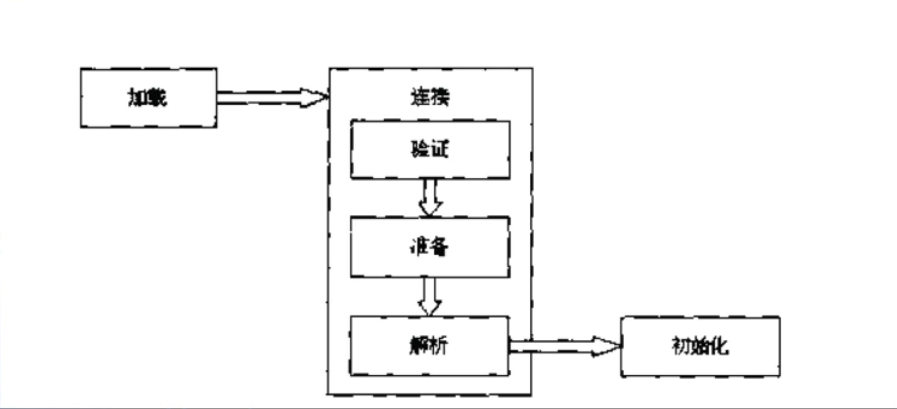

## 类加载
* 类的加载指的是将类的.class文件中的二进制数据读入到内存中，将其放在运行时数据区的方法区中，然后在内存中创建一个java.lang.Class对象（规范并未说明Class对象位于哪里，HotSpot虚拟机将其放在了方法区中）用来封装类的方法区内的数据结构
* 在Java代码中，类型的加载、连接与初始化过程都是在程序运行期间完成的
    * 加载：查找并加载类的二进制数据。类型的加载最常见的一种类型加载是将已经存在的class文件从磁盘中给加载到内存当中
    * 连接（将类与类之间关系确定好，并且对于字节码相关的验证、处理等是在加载连接过程中完成）
        * --验证：确保被加载的类的正确性
        * --准备：为类的**静态变量**分配内存，并将其初始化为**默认值**
        * --解析：**把类中的符号引用转换为直接引用**
    * **初始化：为类的静态变量赋予正确的初始值**。对于类型里面的一些静态变量的赋值过程是在初始化阶段完成
    * 使用
    * 卸载，从内存中销毁加载的类
    
* 提供了更大的灵活性，增加了更多的可能
## 类加载器
* Java里面的每一个类型，比如`java.util.Date`、`java.lang.String`等，最终的数据结构或信息被纳入到jvm的管辖范围之内，换句话说进入到了内存当中，这个进入内存中的过程是由类加载器做到的，即类加载器是加载类的工具
* 在如下几种情况下，Java虚拟机将结束生命周期：
    * 执行了`System.exit()`方法
    * 程序正常执行结束
    * 程序在执行过程中遇到了异常或错误而异常终止
    * 由于操作系统出现错误而导致Java虚拟机进程终止
## 类的加载、连接和初始化
* Java程序对类的使用方式可以分为两种：
    * --主动使用（七种）
        * --创建类的实例
        * --访问某个类或接口的静态变量，或者对该静态变量赋值
        * --调用类的静态方法
        * --反射（如`Class.forName("com.test.Test")`）
        * --初始化一个类的子类
        * --Java虚拟机启动时被标记为启动类的类（Java Test）
        * --JDK1.7开始提供的动态语言支持：`java.lang.invoke.MehodHandle`实例的解析结果REF_getStatic，REF_putStatic，REF_invokeStatic句柄对应的类没有初始化，则初始化
    * --被动使用，除了以上七种情况，其他使用Java类的方式都被看作是对类的**被动使用**，都不会导致类的**初始化**
* 所有的Java虚拟机实现必须在每个类或接口被Java程序“**首次主动使用**”时才初始化他们
